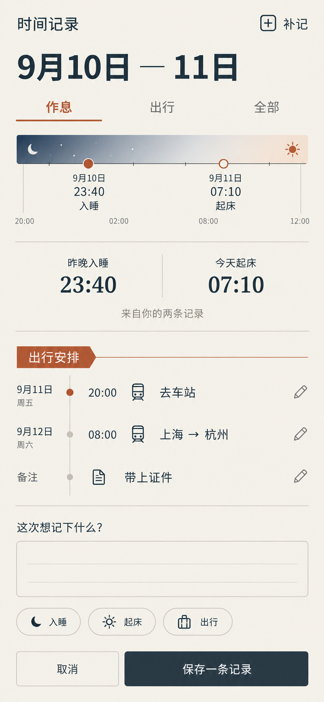
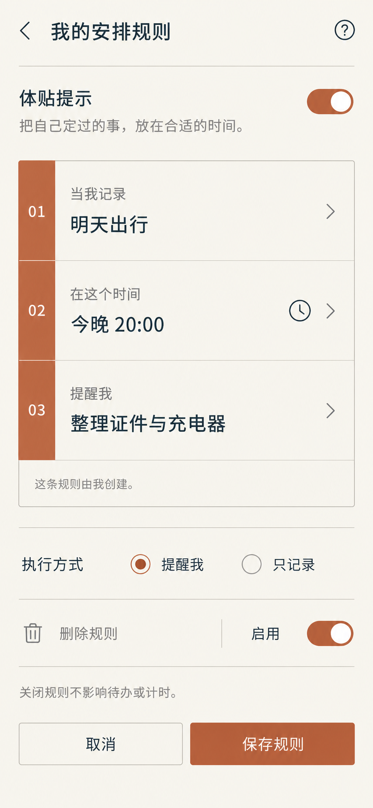

# 有常 × 潮有信 · 差异化视觉提案 V2

> 两壳仍为留档冻结状态。本次仅响应用户授权进行视觉探索，不解除冻结、不确定正式名字/主色/字段、不启动工程拆分或开发排期。源文档未修改。

## 本次方向

| 维度 | 有常 | 潮有信 |
|---|---|---|
| 母页结构 | 日期带、纵向日程轴、底部活动计时条 | 暮紫页眉、浅色记录纸页、待办与记录分区 |
| 导航 | 顶部今日/本周/记录；底部操作栏 | 底部今天/留记/我的；浮动语音入口 |
| 记录 | 以时间点组织作息和出行 | 先自由书写，再添加可选日期/感受标记 |
| 规则 | 编号化的条件—时间—动作便签 | 用户写给自己的话＋出现条件 |
| 配色 | 燕麦纸白、墨色、陶土橙 | 杏白、暮紫、淡丁香与柔杏 |
| 容器 | 细分隔线、小圆角、开放排版 | 分区纸页、局部柔和色块、留白 |

共同保留待办、记录、提醒、运动与语音能力；差异来自信息组织和操作方式，而不只是换色。首页需有记录才显示体贴复述；图中字段、导航和颜色只是候选设计，不是冻结项定稿。

## 六张最终图片

| 壳 | 页面 | 原图 |
|---|---|---|
| 有常 | 母页·日程手账 | [查看](yc-v2-01-home.png) |
| 有常 | 特有页·作息与出行轴 | [查看](yc-v2-02-record.png) |
| 有常 | 特有页·规则便签 | [查看](yc-v2-03-rule.png) |
| 潮有信 | 母页·私人记录簿 | [查看](cyx-v2-01-home.png) |
| 潮有信 | 特有页·感受纸页 | [查看](cyx-v2-02-record.png) |
| 潮有信 | 特有页·给自己的话 | [查看](cyx-v2-03-rule.png) |

## 设计说明与后续校验

- 有常时间轴为事件顺序示意，不应当成等比例小时刻度；时间带若正式采用比例图，必须按真实日期时间计算位置，不能照抄生成图的坐标。
- 潮有信自由文本中的字数计数是生成图示意，非字段上限决定；正式实现实时计算或移除计数。
- 潮有信的“只提醒，不替我改安排”是固定规则说明，不提供反向自动改动开关。规则中的话是用户自写，不是应用根据身体状况给出的建议。
- 有常规则页的顶部开关控制整体体贴提示，底部开关控制当前规则；若后续测试显示容易混淆，可把整体开关移到设置。当前仍属提案。
- 当前页面示例不提供周期预测、训练强度推荐、健康评分或异常阈值；不把未填写当作异常。
- 两壳主题与规则范围不同，但不是不同能力权限等级；记录字段都可选。未验证本地存储/隐私能力前，不在图中承诺数据永不上传。
- 图像用于布局探索，不是运行截图。已目视检查主要文字与层级，未执行真机、小屏大字、触控或读屏验证；正式布局应使用至少48dp触控区域和系统安全区。
- 两个母页为新生成，各自特有页引用其母页；潮有信母页去除装饰插画并压缩页眉，规则页去掉误导性开关。提示词见prompts.json，追加修订见refinements.json。
- 当前V2以这六张为准；上一级早期同构试稿只作过程资料。本次不补共用计时页，不以换色页充当特有页面。

## 来源

[两壳定位V2](D:/FromGit/todolist/docs/research/two-shells-positioning.md) · [旧差分留档](D:/FromGit/todolist/docs/research/direction-split-youchang-chaoyouxin.md)。只采用定位与产品原则，不将历史医学/法律判断作为此次设计验证结论。

## 预览

### 有常 · 母页·日程手账

### 有常 · 特有页·作息与出行轴

### 有常 · 特有页·规则便签

### 潮有信 · 母页·私人记录簿

### 潮有信 · 特有页·感受纸页

### 潮有信 · 特有页·给自己的话

