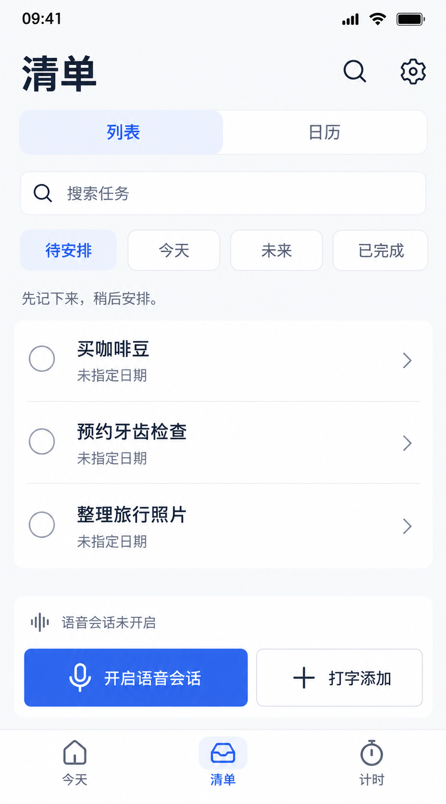
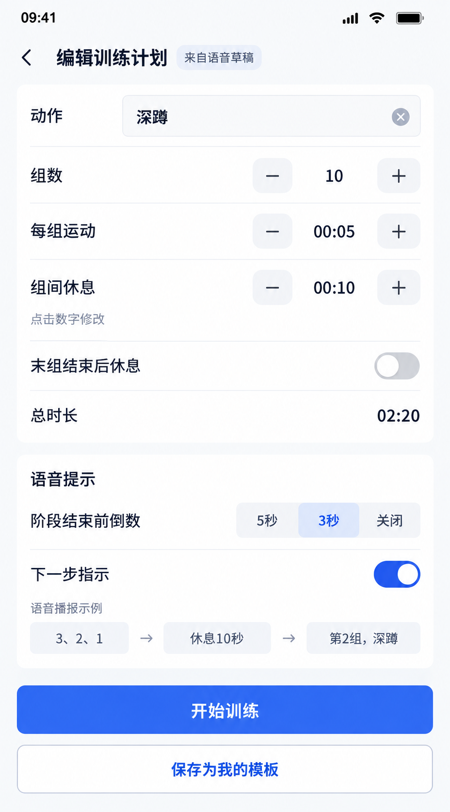
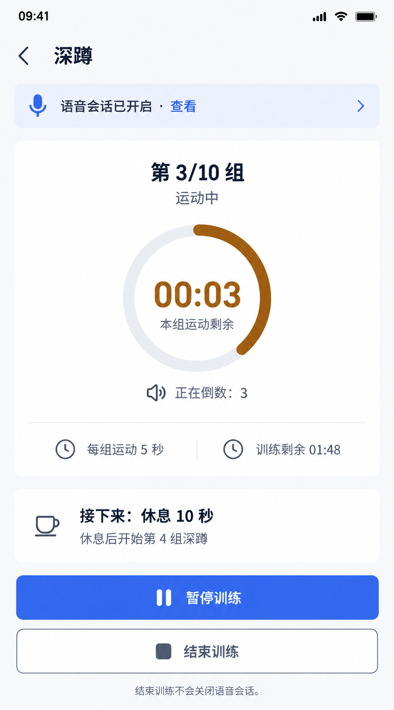
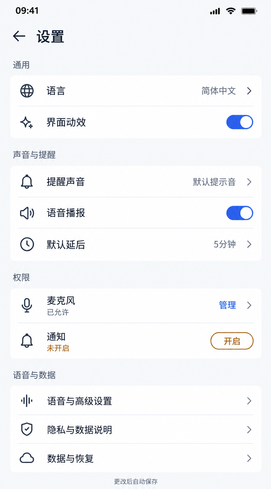
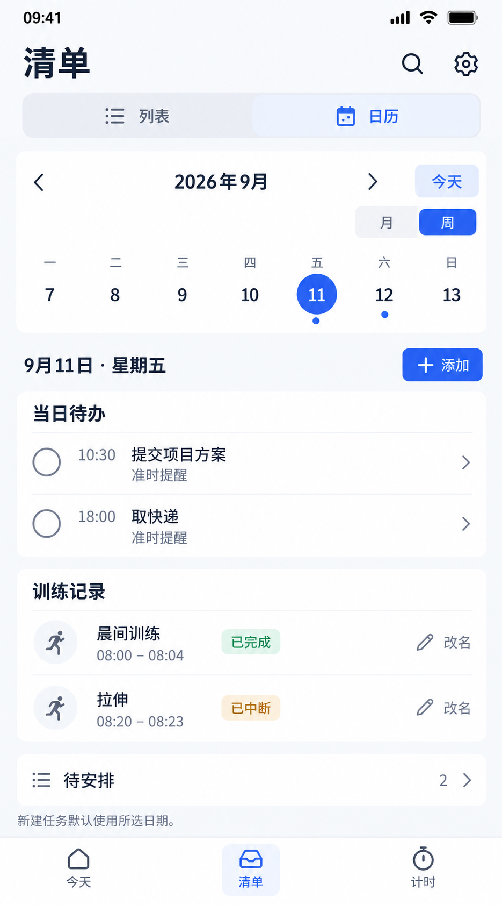

# 1330 · 页面修订稿 V2

共10张：7张修订、3张重做。已按最新口述训练需求调整，语音创建为主、模板套用可选。旧v1完整保留。

权威补充：[口述训练模型](D:/FromGit/todolist/docs/plan/1330/05-spoken-training-model.md)。其中末组无休息是本次显式提出的默认建议，示例总时长02:20；启用末组休息为02:30。阶段末5秒/3秒报数，不是开跑前等待。

| 编号 | 页面 | 类型 | 最终图片 |
|---|---|---|---|
| 01 | 今天 | 局部修订 | [原图](01-today-v2.png) |
| 02 | 清单列表 | 局部修订 | [原图](02-lists-v2.png) |
| 04 | 语音会话内录音 | 结构重做 | [原图](04-voice-listening-v2.png) |
| 05 | 语音训练自动启动 | 结构重做 | [原图](05-training-started-v2.png) |
| 07 | 语音训练入口与活动列表 | 局部修订 | [原图](07-timers-v2.png) |
| 08 | 通用训练计划编辑 | 局部修订 | [原图](08-training-plan-v2.png) |
| 09 | 训练运行 | 局部修订 | [原图](09-timer-running-v2.png) |
| 12 | 设置分层 | 结构重做 | [原图](12-settings-v2.png) |
| 13 | 首次使用 | 局部修订 | [原图](13-first-use-v2.png) |
| 14 | 日历与训练记录 | 局部修订 | [原图](14-calendar-v2.png) |

## 使用规则

- 05是自动创建后的运行反馈，不是常规确认页；可与运行页合并呈现，不要求额外多点一次“查看”才能计时。
- 08用于已停止后的纠错或模板编辑；正常口述创建不必经过它。直接修改数字，保存模板是可选操作。
- 07语音入口优先，模板可套用修改。有活动训练时不得无提示覆盖；图片底部已注明单活动限制。
- 09示例：深蹲10组，运动5秒、组间休息10秒，末组无休息；第三组运动剩3秒时，全程剩01:48。
- 01/02的会话状态演示不同场景，不表示同一瞬间的跨页截屏。任务已保存与提醒已安排独立表达。
- 12中的权限、自动保存，以及通知控制均为目标设计，实施前必须接真实能力；图像不等于功能已实现。
- 14当前展示周视图与训练记录，月视图复用旧14基础并适配滚动。
- 本轮没有完成全部N01–N04独立页面与S01–S08状态组；04覆盖N01部分运行内容，不冒称全套状态稿完成。
- 所有图片已目视核对主要文案和字段，尺寸见manifest；不同图片像素尺寸可能不同，按逻辑布局重建，不拉伸原图作为UI。
- 仍需实现验证：长句换行、48dp独立命中区、小屏/大字体、键盘、系统权限与通知。不以图片中线宽或图标细节作为精确代码参数。
- 提示词以final-prompts.json为准。早期prompts-v2.json仅为过程记录，已被最新口述模型替代。

## 逐页预览

### 01 今天

### 02 清单列表

### 04 语音会话内录音

### 05 语音训练自动启动

### 07 语音训练入口与活动列表

### 08 通用训练计划编辑

### 09 训练运行

### 12 设置分层

### 13 首次使用

### 14 日历与训练记录

