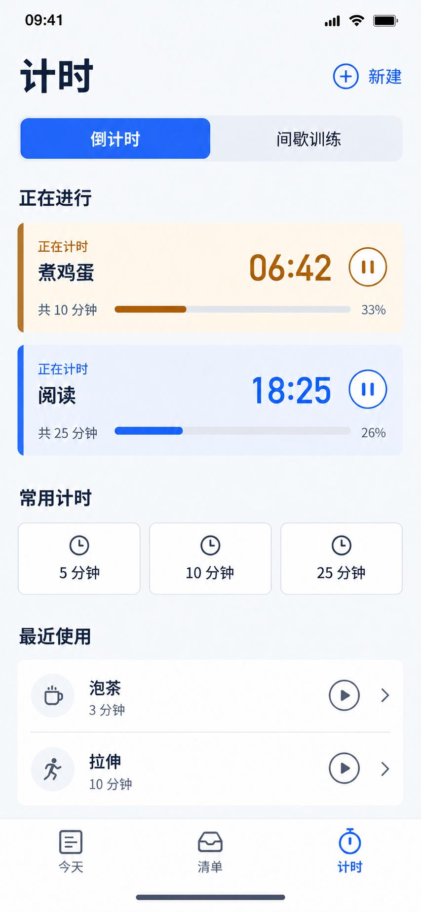
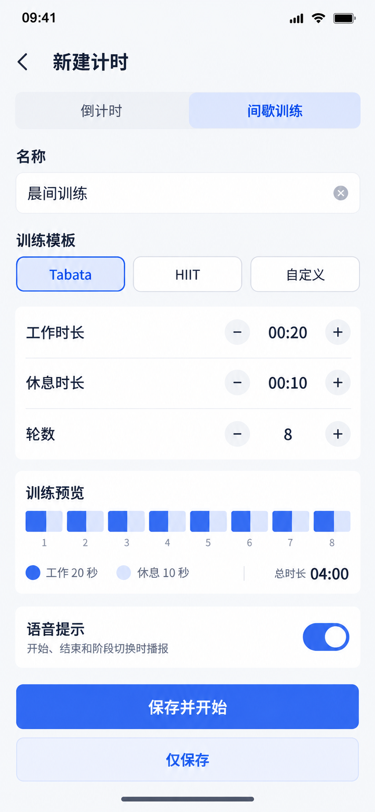
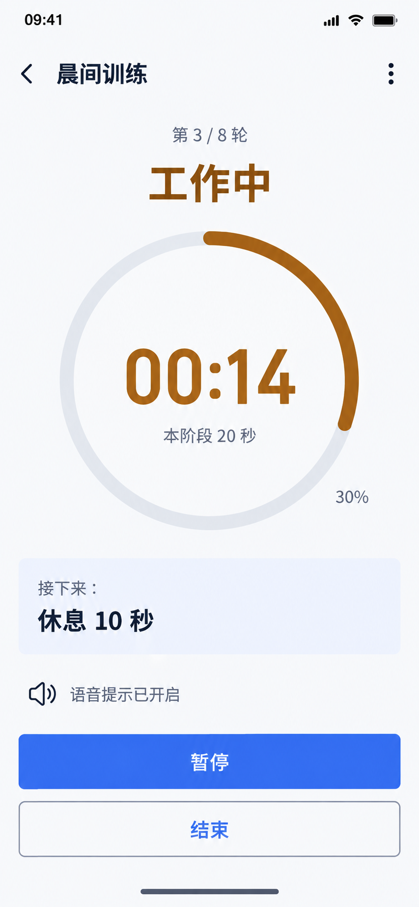
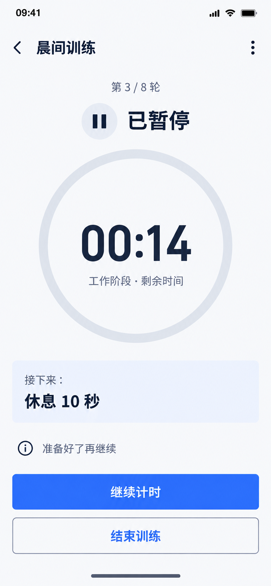
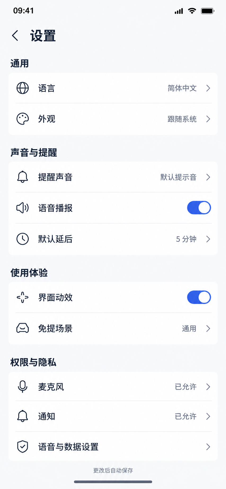
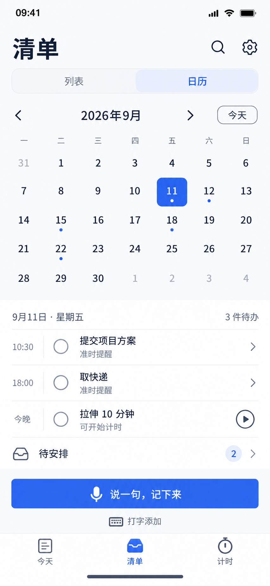

# VoiceTodo · 14 张页面开发底图

2026-09-11 · 内置 ImageGen · 基于联网调研后的新视觉母版 · 原套 13 张，追加 1 张日历，共 14 张单页 PNG。

## 页面索引

| 编号 | 页面 | 文件 | 开发说明 |
|---|---|---|---|
| 01 | 今天 | [原图](01-today.png) | 主导航首页；点击任务进入 03，语音进入 04，文字进入 06，运行计时进入 09。 |
| 02 | 清单 | [原图](02-lists.png) | 待安排筛选态；未来/已完成复用同一列表结构。时间未指定时保持未安排。 |
| 03 | 任务编辑 | [原图](03-task-editor.png) | 现有任务编辑；更多菜单承载删除和标记完成。保存前校验，取消不覆盖原值。 |
| 04 | 语音聆听 | [原图](04-voice-listening.png) | 正在聆听示例；文字应支持自动换行。完成录音进入处理态再到 05，取消不保存。 |
| 05 | 识别确认 | [原图](05-voice-confirm.png) | 确认理解结果；日期、时间、标题和重复规则可修改；确认后才保存。 |
| 06 | 文字添加 | [原图](06-text-add.png) | 文字输入与键盘同时显示；键盘使用系统输入法，避免遮挡添加按钮。 |
| 07 | 计时列表 | [原图](07-timers.png) | 同时运行两个计时器；百分比统一表示已过时间。阅读 25:00−18:25=06:35，约 26%。 |
| 08 | 间歇配置 | [原图](08-timer-editor.png) | 8 轮，每轮工作20秒+休息10秒，包含末轮休息，总时长04:00。预览色块是阶段示意，准确比例由实现计算。 |
| 09 | 计时运行 | [原图](09-timer-running.png) | 工作阶段剩14秒/共20秒，已过30%。暂停进入10，结束需确认。 |
| 10 | 计时暂停 | [原图](10-timer-paused.png) | 暂停保持剩余时间不变；继续恢复当前阶段，不重新开始该轮。 |
| 11 | 到期提醒 | [原图](11-reminder.png) | 应用内到期提醒；选择延后时长后需点延后按钮才生效，标记完成取消后续本次提醒。 |
| 12 | 设置 | [原图](12-settings.png) | 设置一级页面；自动保存需有失败反馈。已允许为演示状态，必须读取真实系统权限。 |
| 13 | 首次使用 | [原图](13-first-use.png) | 首次使用；仅在实际使用语音/提醒时申请相应权限。图中‘不再错过’建议开发文案改为‘查看提醒与计时进度’，避免绝对承诺。 |

| 14 | 日历与当日安排 | [原图](14-calendar.png) | 清单内列表/日历切换；点日期筛选当日任务，月份箭头切换，今天回到当前日。 |

## 使用边界

- 本套为手机竖屏底图；不包含 Windows 专用稿、深色主题和全部异常状态。它覆盖 14 个关键页面/状态，不表示完整产品所有状态都已出图。
- 现有 MAUI 代码不是页面范围限制；这些是指导后续开发的目标设计，不是已实现功能截图。
- 主色、文字、间距和行为以 [设计规范](../design-direction-v1.md) 为准。图像中的渐变、线宽、原生状态栏、键盘和图标不得直接当作像素级实现参数。
- 图片中的当前时间、权限和语音文本都是示例。实时识别、多个计时器、暂停、搜索和自动保存等需另行实现与验证。
- 本稿已逐图目视检查主要中文、控件完整性、页面用途和状态；没有进行 MAUI 构建、真机渲染、读屏或动态布局测试。
- 未独立出图的加载/空/错误/保存中状态遵循现有组件；错误提供重试、取消和保留输入，不能仅用颜色表示。
- 原始生成提示词见 [prompts.json](prompts.json)，三次局部修订见 [corrections.json](corrections.json)，最终文件身份见 [manifest.json](manifest.json)。10 暂停页实际引用 09 运行页以稳定几何布局，其余引用首页母版。

## 逐页预览

### 1. 今天

主导航首页；点击任务进入 03，语音进入 04，文字进入 06，运行计时进入 09。

### 2. 清单

待安排筛选态；未来/已完成复用同一列表结构。时间未指定时保持未安排。

### 3. 任务编辑

现有任务编辑；更多菜单承载删除和标记完成。保存前校验，取消不覆盖原值。

### 4. 语音聆听

正在聆听示例；文字应支持自动换行。完成录音进入处理态再到 05，取消不保存。

### 5. 识别确认

确认理解结果；日期、时间、标题和重复规则可修改；确认后才保存。

### 6. 文字添加

文字输入与键盘同时显示；键盘使用系统输入法，避免遮挡添加按钮。

### 7. 计时列表

同时运行两个计时器；百分比统一表示已过时间。阅读 25:00−18:25=06:35，约 26%。

### 8. 间歇配置

8 轮，每轮工作20秒+休息10秒，包含末轮休息，总时长04:00。预览色块是阶段示意，准确比例由实现计算。

### 9. 计时运行

工作阶段剩14秒/共20秒，已过30%。暂停进入10，结束需确认。

### 10. 计时暂停

暂停保持剩余时间不变；继续恢复当前阶段，不重新开始该轮。

### 11. 到期提醒

应用内到期提醒；选择延后时长后需点延后按钮才生效，标记完成取消后续本次提醒。

### 12. 设置

设置一级页面；自动保存需有失败反馈。已允许为演示状态，必须读取真实系统权限。

### 13. 首次使用

首次使用；仅在实际使用语音/提醒时申请相应权限。图中‘不再错过’建议开发文案改为‘查看提醒与计时进度’，避免绝对承诺。

### 14. 日历与当日安排

清单内的日历视图；周一为首列。已核对 2026 年 9 月从周二开始，11 日为周五。日期点表示当天有事项，选中日联动下方列表。没有日期的事项留在待安排。今日按钮返回当前日期。重复事项按实际发生日期展示；跨月和六行月份保持日期格可点击，必要时滚动页面。页面日期格在紧凑图中仅为视觉示意，开发时应确保触控区域、系统大字体和滚动布局可用。

生成提示词：[14-calendar.prompt.txt](14-calendar.prompt.txt)。这是新增设计底图，未实现或真机验证。

