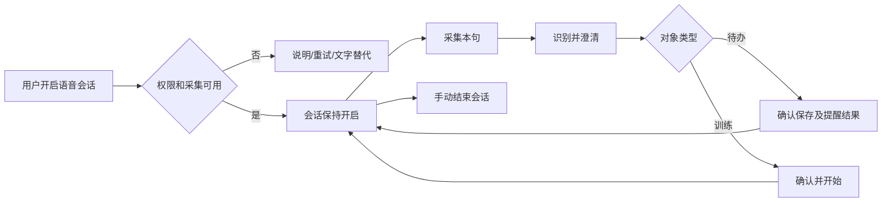

> 最新口述训练要求以 [05-spoken-training-model.md](05-spoken-training-model.md) 为准：直接口述创建并开始，模板可选套用修改。本文早期确认/模板取舍如有冲突，以05为准。

# 1330 · 新增页面与状态设计任务书

> 本文是设计规格，不包含新生成图片。N 为页面级方案；S 为复用状态/组件规格组，组内可能包含多张状态图。总出图张数在逐状态排版时确认，不以“4+8”冒充12张单屏图。

## 1. 新增页面级方案

### N01 常驻语音会话控制（第一优先级）

- **为什么新增：** 旧04只表达单次录音，缺 D1 的长期会话开启/关闭与跨页状态。
- **入口：** 首页“开启语音会话”、主页面会话条、常驻通知。实现可复用 VoiceCapturePage 的外壳，不强制新增 ContentPage。
- **布局：** 顶部返回；会话状态与采集状态；最近一条识别/执行结果；当前输入区；完成本句/取消本句；独立的“结束语音会话”。
- **状态：** 未开启、启动中、会话已开等待输入、正在采集、处理中、待确认、系统中断。
- **交互：** 返回保留已开启会话；取消本句不结束会话；结束会话释放采集资源并移除相关通知。训练按自身生命周期继续。
- **反馈：** 启动失败返回可重试状态，不能显示已开启；中断后需用户恢复，不能静默假装仍在监听。
- **文案：** “语音会话已开启”“正在采集声音”“本句已取消”“语音会话已结束”。等待输入时是否仍采集，以真实实现决定说明。
- **底图参考：** 旧04/05的字阶、波形与结果卡；首页母版全局色彩。
- **依赖：** DEV-03、DEV-06；单次60秒上限不能用作会话空闲超时。

### N02 隐私与数据说明（基础版本必须有）

- **入口：** 首次使用和设置“隐私与数据”。
- **布局：** 语音用于什么、何时采集、停止方法、音频/文本保存位置与期限、是否联网、系统备份、权限说明、版本与说明更新时间。
- **交互：** 返回原页面；权限入口到S01；数据问题入口到N04。
- **要求：** 文案依据最终实现；不承诺未验证的完全离线/永不上传。不能把正文写成开发工具配置清单。
- **设计状态：** 正常说明页即可；删除数据不是该页的主操作，本轮不设计一键清空。
- **依赖：** DEV-03/06/08给出真实数据路径与采集行为后才能定稿具体承诺。

### N03 语音与高级设置（替代一级页技术字段）

- **入口：** 设置“语音与高级设置”。
- **布局：** 识别语言；识别引擎可用状态；播报声音选择与试听；会话说明；诊断入口。
- **交互：** 当前引擎不可用时说明原因与修复动作；测试声音不改变正式提醒；改变配置失败保留旧有效项。
- **边界：** 已有模型切换可保留，但不新增未经实现的在线下载、自动迁移或云模型能力；不让用户手填铃声路径和引擎代号完成普通设置。
- **状态：** 正常、引擎缺失/不可用、保存失败。错误详情默认折叠，日志导出脱敏。
- **参考：** 旧12分组与字段行；依赖DEV-03/08。

### N04 数据恢复与导出（分阶段交付）

- **入口：** 设置“数据与恢复”、全局读取失败提示。
- **首期布局：** 数据读取状态、重试、保存原始数据副本/联系诊断入口；失败原因用用户语言表达。
- **交互：** 读取失败时禁止将空状态写回；只读导出保留原文件。恢复必须有来源和结果说明。
- **后期扩展：** 导出格式、导入预检、重复项策略、覆盖确认和恢复结果。后期功能在DEV-09完成前不展示可用按钮。
- **边界：** 不设计无保护的“重置全部数据”；完整备份中心非首期前置，底层安全写入是前置。
- **参考：** 旧12分组与S04错误卡；首期DEV-01/08，导入导出DEV-09。

## 2. 必补状态与组件规格

| ID | 状态组 | 出现位置 | 必须表达 | 操作及验收 |
|---|---|---|---|---|
| S01 | 权限说明与拒绝恢复 | 首次录音/提醒、设置 | 为什么需要、未授权、已拒绝、需去系统设置 | 继续申请/改用文字/打开设置；只申请当前动作需要的权限；系统授权窗不自绘 |
| S02 | 采集/识别失败与处理中 | 04、N01 | 未听清、麦克风不可用、引擎不可用、正在处理 | 重试、改文字、取消；保留已获得内容，不无限转圈 |
| S03 | 训练确认与歧义澄清 | 05、N01 | 工作/休息/轮数/总时长、明确开始；“那个任务”的候选对象 | 编辑计划、确认并开始、取消；不取首个模糊匹配执行删除 |
| S04 | 保存/调度结果与加载失败 | 03/05/06/11/12及列表 | 保存中、成功、任务已存但提醒失败、数据读写失败 | 禁止重复提交；重试调度不重建任务；保存失败保留草稿 |
| S05 | 计时系统中断与恢复 | 07/09/10、重启后 | 用户暂停与系统中断的区别、可恢复/不可恢复原因 | 恢复、结束并留痕；不重置阶段时间、不伪造完成 |
| S06 | 训练完成与历史 | 09结束、14当日记录 | 实际开始结束、计划轮数、完成/中断、记录保存结果 | 返回、再次训练、改名；不以计划时长冒充实际运动时长 |
| S07 | 常驻通知与锁屏控制 | Android系统表面 | 语音会话与训练各自状态、停止与暂停的对象 | 结束会话不结束训练；完成任务停止Nag；通知样式服从系统 |
| S08 | 删除撤销与未保存退出 | 03/06/05及任务行 | 删除对象、撤销结果；退出是否丢弃草稿 | 撤销失败可见；未保存可继续编辑；不承诺整个回收站已存在 |

这8组属于设计任务包，不要求建立全局复杂弹窗框架；优先复用现有按钮、说明条、字段行、系统选择器。通用空态无需再画独立大图，但必须有添加或重试动作。

## 3. 两条关键流程

训练流程：编辑/语音/最近使用 → 同一计划解释 → 用户一次明确开始 → 运行/暂停 → 完成或中断 → 可靠记录 → 日历。会话关闭和训练结束互不暗中影响。

## 4. 需要明确的默认行为（1330提案）

- **只有日期没有时刻：** 保留“未指定时间”，不静默补00:00或09:00；用户选择定时提醒时再要求时刻。数据模型能力不足时先显式要求选时间，不能偷偷使用默认值。
- **结束训练：** 停止活动并写中断记录；删除记录另作操作。
- **提醒页关闭：** 仅关闭页面，不等于完成；后续是否仍提醒需在界面明确。
- **再次开始：** 从完整原计划新建一次运行，不能沿用上一条已完成运行的ID。
- **修改训练：** 默认修改后续新运行的计划，不在运行中隐式改变当前训练。
- **日历添加：** 带入所选日期，用户可改；无日期事项仍留待安排。
- **会话后台权限/通知：** 实现阶段按OS与target版本重新核对官方要求，见复核报告的平台来源；不存在统一“60秒即可算合规”的规则。

这些是明确的设计建议，不自动宣称用户已批准所有新增功能。D1–D3不变，D4不做替代决策。

## 5. 后续生成与落盘约定

沿用内置ImageGen；每次给定页面目标、准确文案、状态、输入样例和旧稿参考。优先单页面图，组件状态板须在文件名中标明，不能混算成页面。

拟定目录为 docs/design/maui/1330，真正生成时再建立；文件名用旧编号-v2或N/S编号。保留提示词、版本、父参考、验收备注。未生成前不提供虚假的原图链接。

主场景为Android手机；Windows宽屏采用同一流程但使用侧栏和适配内容宽度，系统权限/通知另行验证。Windows完整设计包属于后续范围，不能将手机版图称为双端验收。

