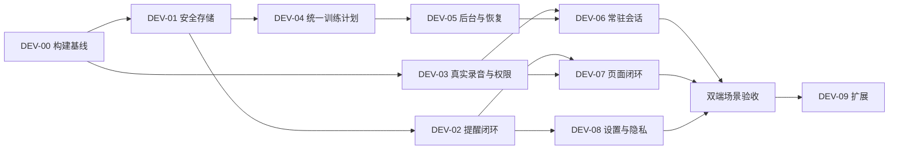

> 最新口述训练要求以 [05-spoken-training-model.md](05-spoken-training-model.md) 为准：直接口述创建并开始，模板可选套用修改。本文早期确认/模板取舍如有冲突，以05为准。

# 1330 · 开发补完与推进步骤

## 1. 任务清单

所有条目初始为 **待实施/待验证**。部分已有代码可复用，具体差距见页面优化报告；下面的完成条件不表示已经执行。

| ID | 优先级 | 补完内容与代码落点 | 设计对应 | 验收要点 |
|---|---|---|---|---|
| DEV-00 | 前置 | 当前Android/Windows构建基线；确认已修集合订阅/Title问题；记录工具链、提交/工作区身份 | 全部 | 两端真实构建结果；不可把静态修正当PASS |
| DEV-01 | P0 | TodoRepository读取失败传播、安全写入替换、保留损坏原件；隔离MockDataSeeder样例库 | S04、N04首期 | 损坏/写入失败不覆盖旧数据，页面不显示假空库 |
| DEV-02 | P0 | 所有任务新建/编辑/完成/删除/延后共用变更与调度规则；稳定通知关联ID；修Nag、重复、预提醒与Snooze语义 | 03/05/06/11、S04/S08 | 任务保存与提醒安排分别反馈；取消后不再响；延后不重复创建 |
| DEV-03 | P0 | 替换Demo真实采集；按需申请权限；区分停止与取消；真实识别错误、草稿保留 | 04/05/13、S01/S02、N03 | 允许/拒绝/永久拒绝均可操作；手动结束得到音频，取消不提交 |
| DEV-04 | P0 | TimerEditor/语音/最近使用统一阶段与轮数表示、总时长和计划重开；一次确认开始 | 05/07/08/09、S03 | 20/10×8含末次休息共4分钟，三入口相同；最近使用保留Phases |
| DEV-05 | P0 | 活动计时持久化、恢复时间基准、后台承载与控制；TimerSession可靠保存 | 09/10/14、S05/S06/S07 | 切页、锁屏、回收、重启分别验收；不把中断记为完成 |
| DEV-06 | P1核心方向 | D1常驻会话生命周期、全局状态、关闭、系统中断恢复、VAD/音频焦点；D3一次确认应答 | N01、04/05/01、S02/S03/S07 | 无空闲自动退出；本句取消与结束会话不同；结束会话不终止训练 |
| DEV-07 | P1 | 清单就地添加、日历任务编辑/当日添加、草稿保护、日期规则一致、保存防重与撤销 | 01/02/03/06/14、S04/S08 | 不绕首页；搜索筛选保持；取消不变更；重复点击不重复写入 |
| DEV-08 | P1 | 设置持久化回读、语言应用、权限动作、用户可读声音选择、隐私与脱敏诊断；初期数据恢复入口 | 12/13、N02/N03/N04 | 重启保持；失败不假装已保存；诊断不暴露原始内容 |
| DEV-09 | P2扩展 | 多计时、导出导入、静默时段/汇总、触觉、小组件按价值分批 | 07、N04扩展、S07 | 核心能力先通过，再逐项设计与验收，不能借扩展掩盖P0 |
| DEV-10 | 横向 | 图标、48dp命中区、字号/小屏/键盘、读屏、Windows适配 | 全部 | 320/360/390dp与200%字号、焦点、长列表；实际设备验证 |

P0/P1表示实施排序建议，不直接覆盖旧总纲的条目编号。本表DEV编号是1330内部追踪ID。

## 2. 分阶段推进

### 阶段0：建立可验证基线

读取当前代码与工作区变化，执行DEV-00；不为旧已修编译问题重复编写修复。建立独立测试数据，记录当前关键操作的真实结果。出现失败留证，不用已有设计图代替应用截图。

输出：构建记录、设备/OS/target信息、实际页面截图清单、仍失败项。没有真机时明确标注设备验收缺口，不虚构锁屏结果。

### 阶段1：让保存与提醒可信

推进DEV-01/02；设计S04/S08与N04首期。真实录音DEV-03和S01/S02可在清楚的文件边界内并行。

输出：任务新增、改期、取消与Nag停止闭环；数据错误可恢复；权限失败有文字替代。基础删除撤销即可，不先做完整回收站。

### 阶段2：训练主链路完成

先DEV-04，再DEV-05；S03/S05/S06/S07同步设计。训练后台和录音后台的权限/服务类型分别评估，普通计时不依赖麦克风开启。

输出：同一计划跨入口一致、一次确认开始、后台状态真实、记录进日历可改名。活动恢复能力不能仅靠静态RunningTimerHub声明完成。

### 阶段3：完成常驻会话

DEV-03与DEV-05的基础能力明确后推进DEV-06；定稿N01与04/05的v2。保持D1无空闲超时，不把60秒单句录音上限当会话超时。

输出：用户可开启、返回浏览、发下一句、取消本句、结束会话；系统中断清楚展示。涉及“删除那个”等歧义指令必须选择或确认目标，不匹配第一项直接执行。

### 阶段4：页面与设置收尾

DEV-07/08及DEV-10贯穿收尾；修订01/02/12/13/14。日历训练记录与待办分层。设置写入和启动回读都测试；隐私内容依据真实实现定稿。

输出：主要页面无需绕路，所有保存有结果，跨页显示一致，真实空态、错误态可用。

### 阶段5：扩展

按需开展DEV-09。多计时虽然已在旧07稿出现，仍需要独立实现与验收；未完成时保留清晰单活动限制和返回当前训练入口。备份导入需先定义冲突/覆盖策略。桌面小组件不作为首期交付门槛。

## 3. 依赖关系

DEV-10贯穿全部阶段。以上是工作依赖，不意味着每阶段只能串行。后台方案技术风险可在阶段0做小范围验证，避免等到最后才发现平台限制。

## 4. 每项交付必须包含

| 层 | 应交付的证据 |
|---|---|
| 设计 | 页面/状态编号、入口和退出、准确文案、数据样例、源稿、无障碍要求 |
| 实现 | 修改文件、实际行为、仍未覆盖边界；复用已有逻辑，不复制多个入口的规则 |
| 自动检查 | 非平凡计算/解析/状态逻辑最小可运行检查；模拟时间、录音、通知和文件失败 |
| 设备检查 | 实际OS、构建身份、复现步骤、截图/日志、结果；锁屏与权限不由mock测试代替 |
| 收尾 | 已完成/未完成、下一依赖；更新追踪状态，不自动宣称发布或部署 |

测试中不启动真实进程或GUI；真机验收另行人工或授权设备操作。文档完成不是实施完成。

## 5. 关键跨页验收样例

1. “明天下午三点取快递”：语音/文字得到一致草稿，保存只有一条任务；通知未允许时仍保存且可补授权。
2. 任务改期后旧通知取消；完成/删除终止该次Nag；延后只产生一次新提醒。
3. “8组，运动20秒，休息10秒”：确认并开始，只确认一次；最近使用重开保持轮次、阶段和4分钟总时长。
4. 第3轮暂停，切页锁屏再回到应用，显示正确轮次和冻结剩余；系统中断与主动暂停不同。
5. 关闭语音会话，训练继续；结束训练，会话如仍开启则保持开启。
6. 当前录音失败可改文字；已修改的草稿不被重新解析覆盖；退出未保存可选择继续。
7. 日历选9月12日添加任务，日期预填12日；回到列表/首页相关视图一致；训练历史单独显示。
8. 损坏JSON、磁盘写入失败不会被空库覆盖；保存失败保留输入且不误报成功。
9. 所有偏好修改后重启保持；模型不可用显示实情；小屏、键盘、读屏和大字仍可完成核心操作。

## 6. 复核与回填

现有证据与Android来源集中在 [页面优化报告](D:/FromGit/todolist/docs/plan/page-optimization-review.md)。本组未重新开展平台调研，实施前再次核对目标OS/target SDK与合并Manifest；不能从文字“四件套”推导后台可靠性已通过。

执行期间只回填真实结果。每个DEV项可分别填写设计/代码/构建/设备状态，不用单个“已实现”掩盖其中一层缺口。当前本组仅达到规划文档完成。

