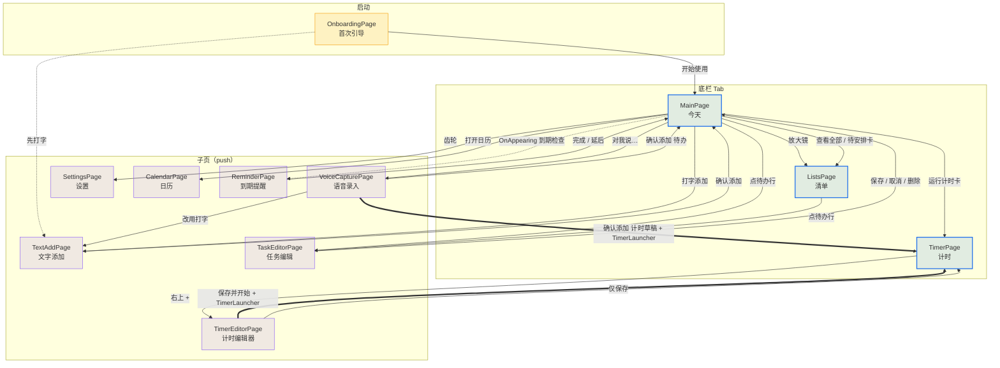

# VoiceTodo 页面与功能 · 交互逻辑总览

> 快照时间：2026-09-11 12:45（**含新开发内容**：任务编辑 / 计时编辑器 / 语音录入 / 文字添加 / 到期提醒 / 首次引导）；同日追加第九、十节（**用户严苛自查 + 联网调研**）。
> 用途：说清「有哪些页面、每个页面能做什么、页面之间怎么跳、跳的时候带什么数据」，以及「用户会在哪里不满意」。
> 配套：`voicetodo-master.md`（现状·链路·方向总纲）。本文只讲页面、交互与用户视角的自查。

---

## 目录

- [一、页面清单](#一页面清单11-个-contentpage)
- [二、逐页功能](#二逐页功能)
- [三、页面间跳转图](#三页面间跳转图)
- [四、跳转边表](#四跳转边表含参数)
- [五、跨页数据通道](#五跨页数据通道不是导航但决定页面行为)
- [六、共用的交互模式](#六共用的交互模式11-个页面的统一写法)
- [七、本快照新发现的问题](#七本快照新发现的问题页面交互层)
- [八、与「设计母版 14 屏」的对照更新](#八与设计母版-14-屏的对照更新)
- [九、用户会不满意的地方（严苛自查）](#九用户会不满意的地方严苛自查)
- [十、联网调研补充](#十联网调研补充竞品与平台约束)

---

## 一、页面清单（11 个 ContentPage）

| # | 页面 | 类型 | 路由 / 注册方式 | 进入方式 |
|---|---|---|---|---|
| 1 | **MainPage** 今天 | Tab 根 | `MainPage`（ShellContent） | 启动默认页；引导页「开始使用」 |
| 2 | **ListsPage** 清单 | Tab 根 | `ListsPage`（ShellContent） | 底栏 Tab；首页放大镜、「查看全部」、「待安排」卡 |
| 3 | **TimerPage** 计时 | Tab 根 | `TimerPage`（ShellContent） | 底栏 Tab；首页运行卡；语音/编辑器投放 |
| 4 | **SettingsPage** 设置 | 子页 | `Routing.RegisterRoute` | 首页右上齿轮 |
| 5 | **CalendarPage** 日历 | 子页 | `Routing.RegisterRoute` | 首页工具条「打开日历」 |
| 6 | **TaskEditorPage** 任务编辑 | 子页（带参） | `TaskEditorPage?id=N` | 首页 / 清单页 点待办行 |
| 7 | **TimerEditorPage** 计时编辑器 | 子页 | `Routing.RegisterRoute` | 计时页右上 `+` |
| 8 | **VoiceCapturePage** 语音录入 | 子页 | `Routing.RegisterRoute` | 首页底部「对我说…」 |
| 9 | **TextAddPage** 文字添加 | 子页 | `Routing.RegisterRoute` | 首页底部「打字添加」；语音页「改用打字」；引导页「先打字」 |
| 10 | **ReminderPage** 到期提醒 | 子页（带参） | `ReminderPage?id=N` | **自动**：首页 `OnAppearing` 的到期检查 |
| 11 | **OnboardingPage** 首次引导 | 子页 | `Routing.RegisterRoute` | 首次启动（`onboarding.done` 未置位） |

> 说明：3 个 Tab 在 `AppShell.xaml` 里是 `ShellContent`；其余 8 个在 `AppShell.xaml.cs` 里 `Routing.RegisterRoute`。语音不占导航位，是「今天」页底部的一个按钮。

---

## 二、逐页功能

### 1. MainPage（今天）— 聚合首页

| 区块 | 功能 |
|---|---|
| 日期行 | 显示「M月d日 · dddd」；右侧放大镜 → 清单页，齿轮 → 设置页 |
| 摘要行 | 「共 N 项待办 · M 项计时中」 |
| 运行计时卡 | 琥珀卡，500ms 心跳刷新剩余/进度/百分比；点击 → 计时 Tab |
| 今日安排 | 待办列表（今日及逾期未完成）；**点行 → 任务编辑页**；左侧圆圈 → 勾选完成 |
| 已完成折叠 | 「已完成 N」卡点开/收起；条目同样可点进编辑 |
| 待安排入口 | 📥 收件箱卡，带数量徽标；点击 → 清单页「待安排」筛选 |
| 底部语音条 | 「对我说…」→ 语音录入页；「打字添加」→ 文字添加页 |
| 自动到期检查 | `OnAppearing` 时找**刚到期（24h 内）且未完成**的待办 → 自动推到期提醒页（每条每会话仅一次） |

### 2. ListsPage（清单）— 全量筛选与搜索

- 搜索框：按标题**即时**包含匹配（无防抖）
- 四个筛选胶囊：**待安排 / 今天 / 未来 / 已完成**（今天含逾期）
- 列表行：**点行 → 任务编辑页**；圆圈 → 勾选完成
- 待安排筛选下额外显示提示行，副行时间文案显示「无时间」
- 空态文案随筛选与搜索词切换
- **没有「新建」入口**（缺口）

### 3. TimerPage（计时）— 运行引擎 + 最近使用

| 区块 | 功能 |
|---|---|
| 分段 | 倒计时 / 间歇训练 |
| 正在进行 | 琥珀运行卡（标题/剩余/进度），按钮暂停/继续 |
| 常用计时 | 5 / 10 / 25 分钟卡片，点击**进入准备态**（不再直接开跑） |
| 最近使用 | 从仓库读 `TimerItem`，点 ▶ 进入准备态 |
| 预设 | Tabata / HIIT / Circuit 三个 chip（**仍保留**，与编辑器并存，见 D4） |
| 右上 `+` | → 计时编辑器页 |
| 运行视图 | 大环形进度 + 剩余 + 轮次 + 「接下来」+ 暂停/继续 + 结束（二次确认） |
| 准备态 | 计划已装载但**未开始**，主按钮显示「开始」；点「开始」才计时并**开始留痕** |
| 跨页继续 | 离开页面仍推进（只更新 Hub，不碰 UI） |

### 4. SettingsPage（设置）— 四组设置

1. **通用**：语言（切换即时生效并写 `Preferences`）、ASR 模型（写模型激活项）
2. **声音与提醒**：自定义铃声、TTS 嗓音、Nag 模式、默认延后（Snooze）、预提醒
3. **使用体验**：界面动效、免提场景（通用/开车/做饭/健身）、背景音乐共存
4. **权限与隐私**：麦克风 / 通知状态（**只读展示**，无申请动作）

### 5. CalendarPage（日历）— 待办分布 + 计时留痕

| 区块 | 功能 |
|---|---|
| 头部 | `‹` / `›` 换区间、「今天」回跳 |
| 视图切换 | 月视图 / 周视图；视图与选中日期**持久化**（`cal.view` / `cal.sel`） |
| 日期网格 | 代码生成单元格，显示当日待办数；今天描边、选中高亮；点跨月补全格会切月 |
| 当天待办 | 选中日的待办列表；圆圈可勾选完成（**点行无跳转**，缺口） |
| 待安排收容区 | 无日期待办，可折叠展开，带数量徽标 |
| **计时记录图层** | 当天 `TimerSession` 列表：`HH:mm–HH:mm · 标题 · 已完成/已中断` 徽标；**点行可改名** |

### 6. TaskEditorPage（任务编辑）— 待办全字段编辑

- 顶栏：返回 `←`、标题、`⋮`（删除任务，带二次确认）
- 内容卡：标题 `Editor`
- 字段行：**日期 / 时间 / 提醒 / 重复** 四行，点击弹**页内覆盖层**
  - 日期、时间 → `DatePicker` / `TimePicker` + 「完成」
  - 提醒 → 准时 / 提前 10 分 / 提前 30 分
  - 重复 → 不重复 / 每天 / 每周
- 备注卡：`Editor`
- 底部：**保存更改**（`UpdateTodoAsync` 后出栈）/ **取消**
- 日期为空则保存 `DueAt = null`（回到「待安排」）；有日期无时间默认 **09:00**

### 7. TimerEditorPage（计时编辑器）— 新建计时

- 分段：倒计时 / 间歇训练（默认**间歇**）
- 名称输入 + 清空按钮
- 模板 chips：Tabata(20/10×8) / HIIT(30/15×6) / 自定义；**手动步进会自动切成「自定义」**
- 步进器：运动 `±5s`（下限 5）、休息 `±5s`（下限 5）、组数 `±1`（1–30）
- 倒计时面板：`±30s`（下限 30）+ 5/10/25 分钟快捷键
- 训练预览：色块按轮渲染（超 12 轮截断加「…」）
- 语音提示开关（写 `Preferences["ttsCues"]`）
- 底部：**保存并开始**（写库 + `TimerLauncher` 投放 + 跳计时 Tab）/ **仅保存**（写库后返回）

### 8. VoiceCapturePage（语音录入）— 三态流

| 状态 | 界面与行为 |
|---|---|
| **Listening** | 波形条 + 计时；最长 60s 自动收尾；「完成」手动收尾；「✕」退出；「改用打字」→ 文字添加页 |
| **Recognizing** | 胶囊文案切「识别中…」 |
| **Confirm** | 展示「你说的是」原文 + 解析草稿（事项/日期/时间/提醒/重复）**均可点开覆盖层修改** |
| **Error** | 无识别结果时显示失败面板 + 「重新说」 |

- **确认添加（待办）**：写 `AddTodoAsync` → 出栈
- **确认添加（计时草稿）**：不写待办；写 `TimerItem` + `TimerLauncher` 投放 → 跳计时 Tab（**先确认再跑**，D3）
- 计时草稿在确认页会**隐藏日期/时间/提醒行**，「重复」行改写为**间歇计划摘要**且不可编辑

### 9. TextAddPage（文字添加）— 打字 + 实时解析

- 输入框 **300ms 防抖** → `IIntentParser` 解析 → chips 展示识别到的日期/重复
- 草稿行（事项 / 时间 / 重复）可点开覆盖层修改
- 选完日期若还没时间，**自动接着弹时间选择**
- 「确认添加」→ `AddTodoAsync` → 出栈

### 10. ReminderPage（到期提醒）— 应用内响应

- 展示任务标题 + 到期时间文案
- **延后**：5 / 10 / 30 分钟 chip，或「自定义时刻」（选时刻，已过则顺延到明天该时刻）
- **标记完成** → `SetTodoDoneAsync`
- 两者执行后均出栈返回

### 11. OnboardingPage（首次引导）

- 品牌头、副标、示例引文、结果示例、两条功能说明
- 「开始使用」→ 置 `onboarding.done` → `//MainPage`
- 「先打字试试」→ 置位 → `//MainPage` → 再推文字添加页

---

## 三、页面间跳转图

> 实线＝用户点击触发；虚线＝非点击触发（自动 / 间接）；**双线**＝跨页状态通道（`TimerLauncher`）。

---

## 四、跳转边表（含参数）

| 从 | 到 | 触发点 | 参数 |
|---|---|---|---|
| OnboardingPage | `//MainPage` | 「开始使用」 | — |
| OnboardingPage | `TextAddPage` | 「先打字试试」 | 先回主 Tab 再 push |
| MainPage | `VoiceCapturePage` | 底部「对我说…」 | — |
| MainPage | `TextAddPage` | 底部「打字添加」 | — |
| MainPage | `TaskEditorPage?id=N` | 点待办行（含已完成区） | `id` |
| MainPage | `ListsPage` | 右上放大镜 | — |
| MainPage | `ListsPage?filter=today` | 「查看全部 ›」 | `filter=today` |
| MainPage | `ListsPage?filter=unscheduled` | 「待安排」卡 | `filter=unscheduled` |
| MainPage | `SettingsPage` | 右上齿轮 | — |
| MainPage | `CalendarPage` | 工具条「打开日历」 | — |
| MainPage | `ReminderPage?id=N` | **自动**（`OnAppearing` 到期检查） | `id` |
| MainPage | `//TimerPage` | 点运行计时卡 | — |
| ListsPage | `TaskEditorPage?id=N` | 点待办行 | `id` |
| VoiceCapturePage | `TextAddPage` | 「改用打字」 | — |
| VoiceCapturePage | `//TimerPage` | 确认添加（计时草稿） | `TimerLauncher.PendingStart` |
| VoiceCapturePage | `..` | 确认添加（待办）/ ✕ / 取消 | — |
| TextAddPage | `..` | 确认添加 / 关闭 | — |
| TaskEditorPage | `..` | 保存 / 取消 / 删除 / 找不到任务 | — |
| ReminderPage | `..` | 完成 / 延后 / 关闭 / 任务不存在 | — |
| TimerPage | `TimerEditorPage` | 右上 `+` | — |
| TimerEditorPage | `//TimerPage` | 「保存并开始」 | `TimerLauncher.PendingStart` |
| TimerEditorPage | `..` | 「仅保存」/ 返回 | — |

---

## 五、跨页数据通道（不是导航，但决定页面行为）

| 通道 | 方向 | 机制 | 用途 |
|---|---|---|---|
| `TimerLauncher.PendingStart` | 计时编辑器 / 语音录入 → 计时页 | 静态字段 + `Changed` 事件；计时页 `OnAppearing` **消费并置空** | 跨页「投放一个待开始的计时」→ 计时页进**准备态**（不自动跑） |
| `RunningTimerHub` | 计时页 → 首页 | 静态快照 + `Changed` 事件；首页订阅 | 首页「正在计时」卡实时显示 |
| `ITodoRepository` | 所有页面 ↔ JSON 仓库 | 各页 `OnAppearing` 重读 | 待办/计时/记录的唯一数据源 |
| `Preferences` | 全局 | 键值 | `onboarding.done` / `lang` / `nagMode` / `audioCoexist` / `ttsVoice` / `ttsCues` / `cal.view` / `cal.sel` / 模型激活项 |
| `AppSettings`（静态字段） | 全局 | 内存 | 场景 / Snooze / 预提醒 / 自定义铃声 / 动效（**重启即丢**） |

> **注意**：页面之间**不直接传对象**，一律靠「仓库 + OnAppearing 重读」或「静态中枢」。所以跨页一致性依赖 `OnAppearing` 是否被触发。

---

## 六、共用的交互模式（11 个页面的统一写法）

1. **页内覆盖层**：`TaskEditorPage` / `TextAddPage` / `VoiceCapturePage` 都用「居中白卡盖在页面上」代替新页面（`ShowOverlay` / `CloseOverlay`），避免导航层级过深。
2. **chips 选中态**：选中＝`SelectedBg` 底 + `Primary` 文字/描边；未选＝透明或 `Surface`。
3. **列表行点击 → 编辑**：首页与清单页已接；**日历页未接**。
4. **仓库直读**：所有页面直接从 `ITodoRepository` 取数，不经 ViewModel 中转（只有 MainPage 用 `MainViewModel`）。
5. **静默降级**：加载失败多写 `catch { }`，不弹错、不阻塞。

---

## 七、本快照新发现的问题（页面/交互层）

| # | 问题 | 位置 |
|---|---|---|
| I-1 | **日历页的待办行点了没反应** | `CalendarPage` 当天待办与待安排列表都没绑 `TapGestureRecognizer`，无法进编辑 |
| I-2 | **清单页没有新建入口** | 只能回首页或走语音/打字 |
| I-3 | **到期提醒窗口只有 24h 且每条每会话一次** | `MainPage.CheckDueReminderAsync`：`d >= now.AddDays(-1)`；`_reminderShown` 为内存 `HashSet`，重启后会再次弹 |
| I-4 | **提醒页不取消系统通知** | 延后/完成只改仓库，未调 `INotificationScheduler` |
| I-5 | **任务编辑页的提醒只有提前 10 / 30 分钟** | 无「准时以外」的更多粒度，也没有 Nag / Snooze 入口 |
| I-6 | **权限仍只 `Check` 不 `Request`** | `SettingsPage.LoadPermissionStatusAsync`；首次使用引导也只是文案，未申请麦克风 |
| I-7 | **麦克风仍是桩** | `MauiProgram` 仍注册 `DemoMicrophoneCapture`，语音录入页拿到的是静音 WAV |
| I-8 | **计时仍单实例** | `RunningTimerHub` 注释明示 MVP 只承载一个；`Mom` 多计时器未做 |
| I-9 | **`MainViewModel.ListenCommand` 已成孤儿** | 首页改用 `OnSayClicked` 跳语音页，`ListenAsync` 只剩 `AddTextAsync` 在用管线 |
| I-10 | **Debug 会自动灌 30 条测试数据** | `MockDataSeeder.SeedIfEmptyAsync` 在 `#if DEBUG` 下于首页 `OnAppearing` 执行 |
| I-11 | **预设 chip 与编辑器模板重复** | 计时页 Tabata/HIIT/Circuit 与 `TimerEditorPage` 的模板各有一套（D4 待定） |

---

## 八、与「设计母版 14 屏」的对照更新

| 设计屏 | 之前 | 现在 |
|---|---|---|
| 01 今天 | 已实现 | 已实现（+ 行点击进编辑、自动到期提醒、Debug 种子） |
| 02 清单 | 已实现 | 已实现（+ 行点击进编辑） |
| 03 任务编辑 | **未实现** | **已实现** `TaskEditorPage` |
| 04 语音聆听 | 部分 | **已实现** `VoiceCapturePage`（波形/60s 上限/改用打字） |
| 05 识别确认 | **未实现** | **已实现**（草稿可改 + 计时走确认后投放） |
| 06 文字添加 | 部分（弹窗） | **已实现**独立页 `TextAddPage`（防抖解析 + chips） |
| 07 计时列表 | 部分 | 部分（仍单实例） |
| 08 间歇配置 | 部分 | **已实现** `TimerEditorPage`（模板/步进/预览） |
| 09 计时运行 | 已实现 | 已实现（+ 准备态） |
| 10 计时暂停 | 已实现 | 已实现 |
| 11 到期提醒 | **未实现** | **已实现** `ReminderPage`（完成 / 延后 / 自定义时刻） |
| 12 设置 | 已实现 | 已实现 |
| 13 首次引导 | **未实现** | **已实现** `OnboardingPage`（但未申请权限） |
| 14 日历 | 部分 | 部分（+ **计时记录图层**，但待办行不可点） |

**统计变化：未实现 4 → 0；部分 5 → 4（计时列表、日历、设置权限、间歇预设重复）。**

---

## 九、用户会不满意的地方（严苛自查）

> 视角：一个真实用户从「下载安装」到「用一周」，逐环节问「哪里会让我骂人 / 卸载」。
> 标注：🔴 致命（装了立刻卸载）· 🟠 严重（用几天就烦）· 🟡 体验糙点（觉得不专业）。

### 9.1 第一次打开就崩（🔴）

| # | 场景 | 用户感受 | 根因 |
|---|---|---|---|
| U-1 | 点「对我说…」→ 说完 → 什么都没发生 | 「这 App 的语音是坏的 / 是骗人的」 | 麦克风仍是 `DemoMicrophoneCapture` 桩，识别恒为空（I-7 / P0-2）。**核心卖点当场被证伪。** |
| U-2 | 首次录音被系统静默拒绝 | 「我按了，它不理我」 | 只 `CheckStatusAsync` 不 `RequestAsync`（I-6 / P0-3），且**根本没有申请动作**。 |
| U-3 | 打开就看到 30 条不认识的待办 | 「这不是我的数据 / 有隐私问题」 | `MockDataSeeder` 在 DEBUG 首页 `OnAppearing` 灌 30 条（I-10），还会混进真实数据、日历与完成统计。 |
| U-4 | 识别失败只看 TTS 一句「未知命令」 | 「到底是我说错还是它坏了？」 | 空识别静默失败（P1-14）；语音页有失败面板，但**不告诉我为什么、该怎么说**。 |

### 9.2 用几天就烦（🟠）

| # | 场景 | 用户感受 | 根因 |
|---|---|---|---|
| U-5 | 健身练到第 3 组，切了首歌 → 计时没了 | 「这计时根本不能用」 | 计时**不落库、无前台服务、无通知**（P1-6）；`RunningTimerHub` 是内存静态快照，进程一断即丢。**健身场景最不能忍的一条。** |
| U-6 | 删了待办提醒照响；Nag 开了停不掉 | 「它在骚扰我，还甩不掉」 | 通知 id 错位（P0-6）、Nag 无终止条件（P0-7）、重复不生效（P0-8）、Snooze 语义用错（P0-9）。 |
| U-7 | 日历里点一条待办想改时间 → 没反应 | 「为什么首页能点，这里不能」 | `CalendarPage` 当天待办行未绑手势（I-1）。 |
| U-8 | 在清单页想加一条 → 找不到入口 | 「还得退回首页」 | `ListsPage` 无新建入口（I-2）。 |
| U-9 | 说错一个词，进库的就是错的，改起来比重说还麻烦 | 「纠错成本太高」 | 语音确认页草稿可改，但任务编辑页提醒只有「准时 / 提前 10 / 提前 30」（I-5），且缺「就地纠错」心智。 |
| U-10 | 每次说一句要等满 8 秒 | 「太慢了」 | 固定 8 秒、无 VAD、无流式（P1-12）。 |
| U-11 | 想同时「煮蛋 3 分钟 + 敷面膜 10 分钟」 | 「只能跑一个？」 | 计时单实例（I-8 / P1-3）。 |
| U-12 | 误删（尤其语音「删掉那个」按子串取首个） | 「数据没了，也没有回收站」 | 无撤销 / 无回收站（P2-7）；歧义取首个（见 5.4）。 |

### 9.3 觉得不专业（🟡）

| # | 场景 | 根因 |
|---|---|---|
| U-13 | 改完设置，重启又变回去 | 一半设置是内存态（P1-9）：`Scene` / `Snooze` / `PreAlert` / `CustomSoundPath` / `UseAnimations`。 |
| U-14 | 切成英文，重启又变回中文 | 启动不读 `Preferences["lang"]`（P1-10）。 |
| U-15 | 部分按钮 / 文案切了语言还是中文 | i18n 硬编码（P1-11）。 |
| U-16 | 「隐私优先」是卖点，却找不到任何隐私说明 | 无 README / 隐私声明 / 版本号（P2-3）；也没有「离线运行」的可信证明。 |
| U-17 | 手机丢了 / 换机 → 数据全无 | 无导出导入 / 备份（P2-7）。 |
| U-18 | 放大字体后界面错乱 | 无障碍未落实（P2-9）：48dp 触控目标、字体缩放未验证。 |
| U-19 | 出问题没有任何可报错的东西 | 无日志、大量 `catch { }`（P2-10）。 |

### 9.4 与「常驻语音」方向的硬冲突（🔴 技术风险，必须先解）

这是 **D1（手动开启 → 后台常驻 → 仅手动关闭）拍板后立刻撞上的平台墙**：

| # | 冲突 | 说明 | 必须的对策 |
|---|---|---|---|
| X-1 | **Android 12+ 不能从后台启动前台服务** | 若「手动开启」发生在 App 已在后台时，`startForegroundService` 会被系统拒绝 | 开启动作必须发生在**可见的 Activity**（用户在 App 内点按钮） |
| X-2 | **Android 14+ 校验 while-in-use 权限** | App 在后台时用麦克风创建 FGS 会抛 `SecurityException`；无正规 FGS 时后台录音**约 60s 上限** | FGS 声明 `type=microphone`；先拿 `RECORD_AUDIO`；必须可见时启动 |
| X-3 | **常驻麦克风的隐私感知** | 研究（MIT VoiceNotes）表明 always-listening 让用户**失去控制感 / 尴尬**，更倾向 push-to-talk | 常驻期必须有**明确的录音指示**（红点 / 常驻通知）+ **一键停止**；空窗期不激活麦克风 |
| X-4 | **会话要状态，但管线无状态** | `VoicePipeline.ProcessTextAsync` 无 Session（见 5.4） | 新增 Session 对象；「删掉它 / 那个」才成立 |
| X-5 | **常驻 = 电量 / 发热 / 音频焦点** | 麦克风常驻 + TTS 播报会与 BGM 抢焦点 | 端点检测（VAD）按需拾音；`AudioCoexist` 压低而非抢占 |

> 结论：**D1 的「后台常驻」在 Android 上是*有条件的常驻***——必须「可见时开启 + 前台服务 + 常驻通知 + 麦克风类型声明」四件套，否则系统会直接掐掉。这条必须写进实现约束，不能只当产品愿望。

---

## 十、联网调研补充（竞品与平台约束）

> 方法：检索「语音待办抱怨」「间歇计时最佳功能」「Android 14 前台服务 / 麦克风限制」「待办类 UX 反感」四类主题，提炼「用户真金白银会要、但当前设计没写」的项。
> 标注：✅ 已做（可能没做全）· 🟡 部分 · ⬜ 未做（建议补）。

### 10.1 计时 / 健身（对标 HIIT / Tabata / Interval Timer 类）

| 能力 | 调研结论 | 本产品 | 落点 |
|---|---|---|---|
| 后台可靠运行 | 所有计时类 App 的**第一诉求**：锁屏 / 切应用仍继续，且锁屏可见 | ⬜ | 前台服务 + 常驻通知（对应 U-5 / P1-6） |
| 大字号中途显示 | 运动中一眼可读 | ✅ | 已有环形 + 大数字 |
| 语音报数 / 口令 | 要能压过健身房噪音，且可开关 | 🟡 | 已有 `ttsCues` 开关；需确保音量 / 音频焦点优先 |
| 震动 / 触觉反馈 | 不看屏 / 戴耳机时靠震动感知换组 | ⬜ | 阶段切换触发 Haptic |
| 自定义 work / rest / rounds | 允许不套模板、自由填 | ✅ | `TimerEditorPage` 步进器 |
| 预设可保存 / 导出 | 收藏自己的组合，最好能导出 JSON 换机 | 🟡 | 有内置模板；无「存为自己的预设」/ 导出 |
| 训练历史 = 日历 | 每次训练落一条，按天回看 | 🟡 | **已部分做**（`TimerSession` + 日历图层，D2） |
| 阶段预告 | 「接下来：休息 20s」 | ✅ | 已有「接下来」 |
| 快速开始 | 从通知 / 锁屏 / 桌面组件一键开始 | ⬜ | 通知按钮 / Widget |
| 多计时并行 | 煮蛋 + 面膜 | ⬜ | P1-3（受 `RunningTimerHub` 单实例限制） |

### 10.2 待办类（对标 Todoist / TickTick / 语音待办）

| 能力 | 调研结论 | 本产品 |
|---|---|---|
| 快速捕捉 | 语音 / 文字 / 小组件 / 通知栏，3 秒内记下 | 🟡 有语音 + 打字；无桌面小组件 / 通知栏快速添加 |
| 今日聚焦 | 用户要「今天该做什么」，不是「全部计划」的焦虑 | 🟡 首页即「今天」；但无「未完成积压」的温和处理 |
| 温和提醒 | 通知轰炸 / Zeigarnik（未完成焦虑）会让用户羞愧、干脆关掉通知 | ⬜ 当前 Nag 是**加重**打扰；需静默时段 / 每日汇总 |
| 提醒可靠 | 到点必响、删了必不响 | ⬜ 恰恰是当前最坏的（U-6） |
| 离线可用 | 隐私型用户尤其看重 | ✅ 端侧离线 |
| 数据可带走 | 导出 / 导入 / 备份 | ⬜ |

### 10.3 语音交互

| 能力 | 调研结论 | 本产品 |
|---|---|---|
| push-to-talk 优先 | 用户要「我说了才听」，不要一直听 | ✅ 与 D1（手动开启）一致 |
| 可打断播报 | 播报中能插话（barge-in） | ⬜ 5.4 已列 |
| 明确录音状态 | 在录 / 没在录，一眼可见 | 🟡 语音页有波形；常驻期缺全局指示 |
| 误识别一键纠错 | 「我说的不是这个」 | ✅ 确认页草稿可改 |
| 指令反馈具体 | 说「已添加：明天下午三点开会」而非只说「已添加」 | 🟡 播报偏笼统 |

### 10.4 平台约束（Android）

| 约束 | 内容 | 影响 |
|---|---|---|
| FGS 启动 | Android 12+ 禁止后台启动前台服务 | 常驻「开启」必须 App 可见 |
| while-in-use 权限 | Android 14+ 后台创建麦克风 FGS 抛异常 | 先授权 + 可见时开启（X-2） |
| 后台麦克风 | 无正规 FGS 时后台录音约 60s 上限 | 录音会莫名中断 |
| 豁免情形 | 用户点通知 / 小组件、`VoiceInteractionService` 等可豁免 | 可作「从通知一键唤起」的合规路径 |

### 10.5 通用底座（跨方向）

| 项 | 说明 |
|---|---|
| 权限申请带说明 | 录音 / 通知前先解释「为什么需要」，被拒后给引导路径 |
| 空状态引导 | 首页 / 清单 / 日历空态都要给出下一步动作 |
| 删除撤销 | 至少 Toast「已删除 · 撤销」 |
| 可观测性 | 关键路径加日志，便于定位（P2-10） |
| 隐私声明 | 把「端侧离线」写成用户可见的承诺（P2-3） |

### 10.6 由此新增的候选待办

1. 计时前台服务 + 锁屏 / 通知控制（**健身场景生死线**）
2. 阶段切换震动反馈（Haptic）
3. 自定义预设保存 / 导出导入（JSON）
4. 桌面小组件 / 通知栏快速添加
5. 通知静默时段 + 每日汇总（根治提醒疲劳）
6. 删除撤销 / 回收站
7. 数据导出 / 导入 / 备份
8. 隐私说明页 + 离线运行说明
9. 关键路径日志（替代 `catch { }` 静默降级）
